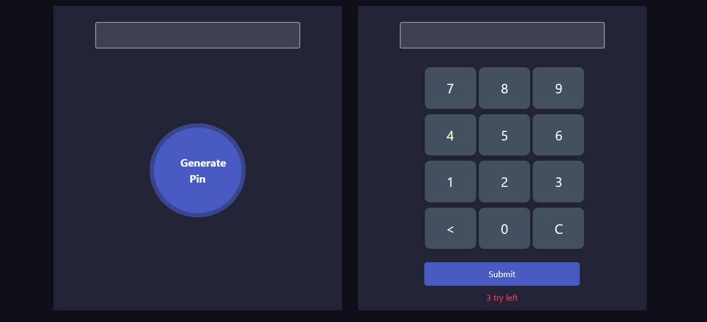

# Pin Matcher 
The Pin Matcher is a simple yet powerful tool designed to help users generate and verify PIN codes. Whether you need a secure PIN for your digital accounts, a quick solution for generating random codes, or a way to validate PINs, this application has you covered.



## Features

- **Generate Random PINs:** Create random PINs of varying lengths to meet your security needs.

- **Verify PINs:** Check if a PIN matches a given code, ensuring accuracy and security.


- **User-Friendly Interface:** An intuitive and responsive design makes it easy for users of all levels to navigate and operate the application.

## Usage

1. Choose the "Generate PIN" option if you need to create a new PIN code. Specify the desired length and click the "Generate" button.

2. If you have a PIN code you want to verify, select the "Verify PIN" option. Enter the code you want to check and provide the PIN to compare it with.

## Technologies Used

- HTML
- CSS
- JavaScript

## Installation

1. Clone the repository to your local machine:

   ```
   git clone https://github.com/Tactsoft-Limited/Pin-Matcher.git
   ```

2. Open the `index.html` file in your preferred web browser.

3. Start generating and verifying PINs!
